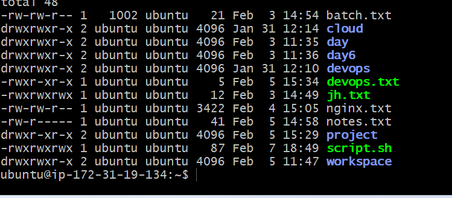
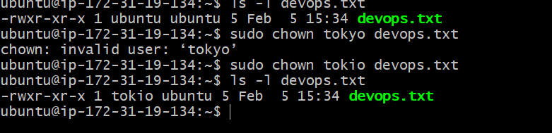
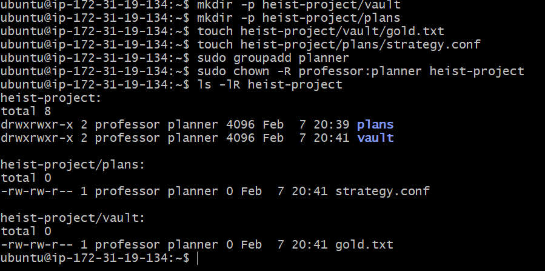

## ls -l output

## Owner change from ubuntu to tokio

## Owner change from tokio to berlin

## Change group from ubuntu to team-heist

## Change owner as well as group

## Change group and owner of directory

## Recursive ownership and group change

# Day 11 Challenge

## Files & Directories Created
- devops-file.txt
- team-notes.txt
- project-config.yaml
- app-logs/
- heist-project/
- bank-heist/

## Ownership Changes
- devops-file.txt: ubuntu → tokyo → berlin
- team-notes.txt: group → heist-team
- project-config.yaml: professor:heist-team
- heist-project/: professor:planners
- bank-heist files with different owners/groups

## Commands Used
- ls -l
- chown
- chgrp
- chown -R

## What I Learned
1. Owner controls file ownership
2. Group enables shared access
3. Recursive ownership is critical for directories

