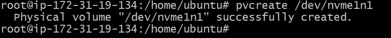
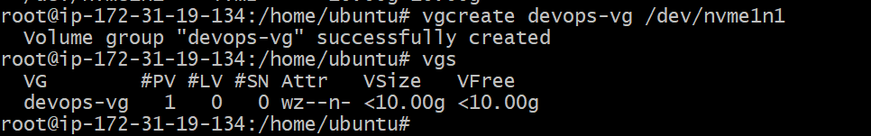
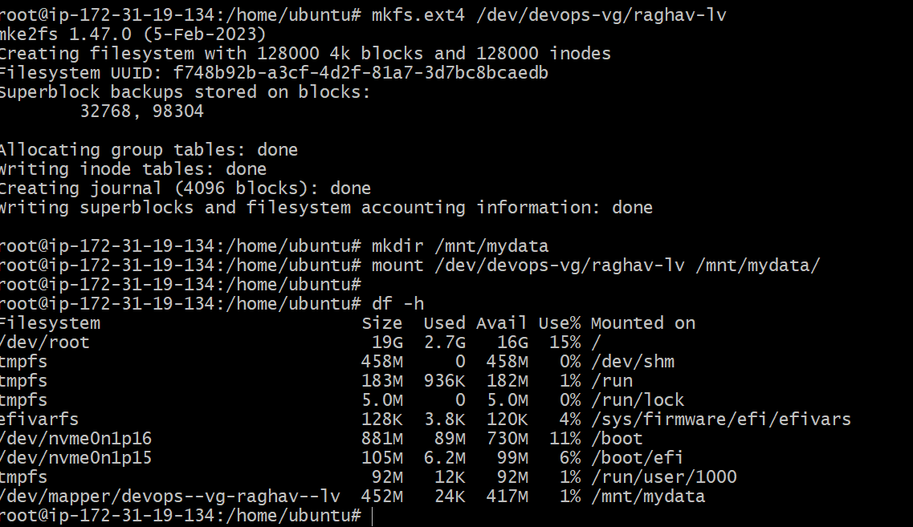
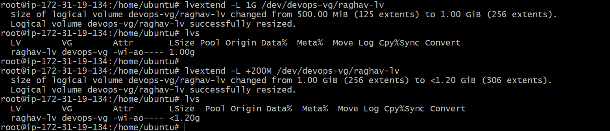

Switched to Root User - Verified root access using sudo su and confirmed with whoami

Created Physical Volume (PV)-
Initialized the disk /dev/nvme1n1 as an LVM Physical Volume using pvcreate.

Created Volume Group (VG)
Created a Volume Group named devops-vg from /dev/nvme1n1 using vgcreate.

Created Logical Volume (LV)
Created a 500MB Logical Volume named raghav-lv inside devops-vg using lvcreate.

Formatted, Mounted & Verified LV-
Formatted the LV with ext4, mounted it on /mnt/mydata, and confirmed using df -h.

Extended Logical Volume (LV)-
Increased LV size from 500MB → 1GB → +200MB using lvextend and verified with lvs.

# Day 13 – Linux Volume Management (LVM)

# Overview
Today I learned how to use LVM to create flexible storage by creating:
- Physical Volume (PV)
- Volume Group (VG)
- Logical Volume (LV)
Then I formatted, mounted, and extended the LV.

---

# Task 1: Check Current Storage

# Commands

lsblk
df -h
pvs
vgs
lvs
